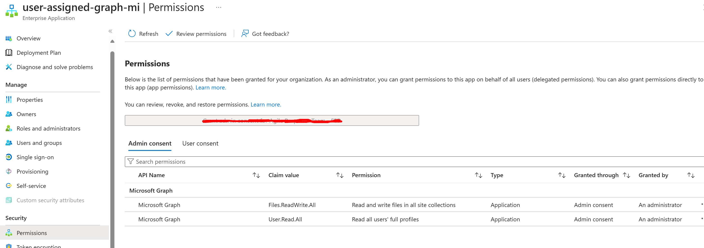
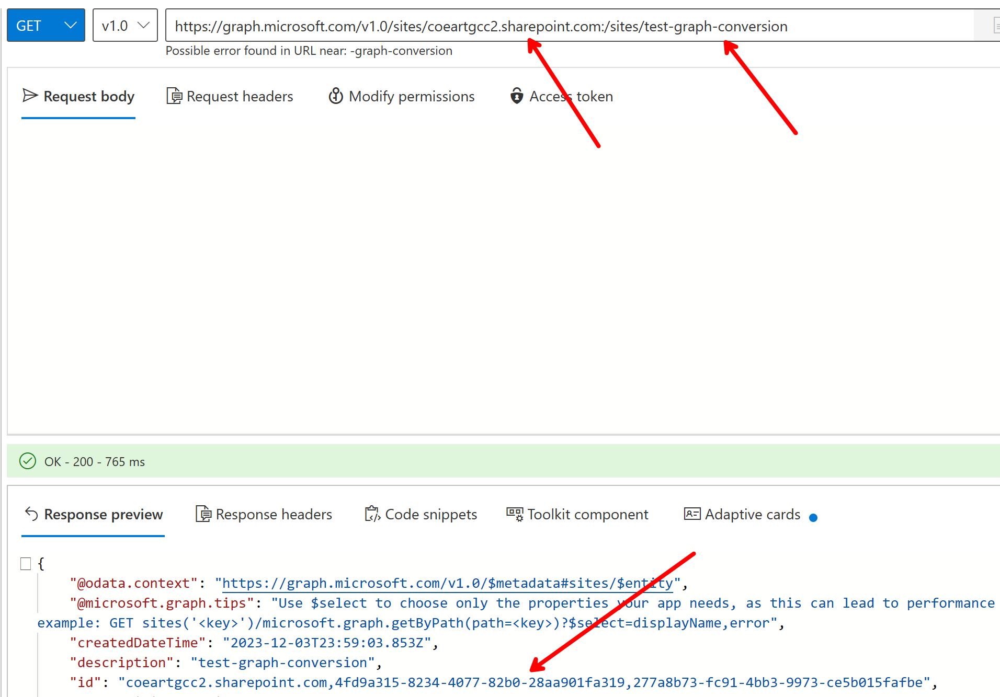
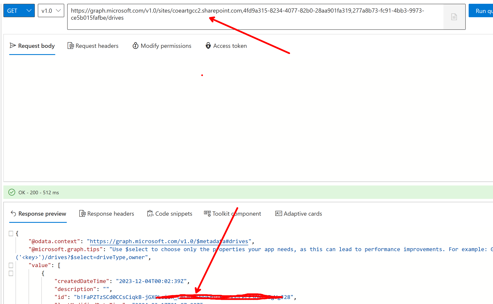
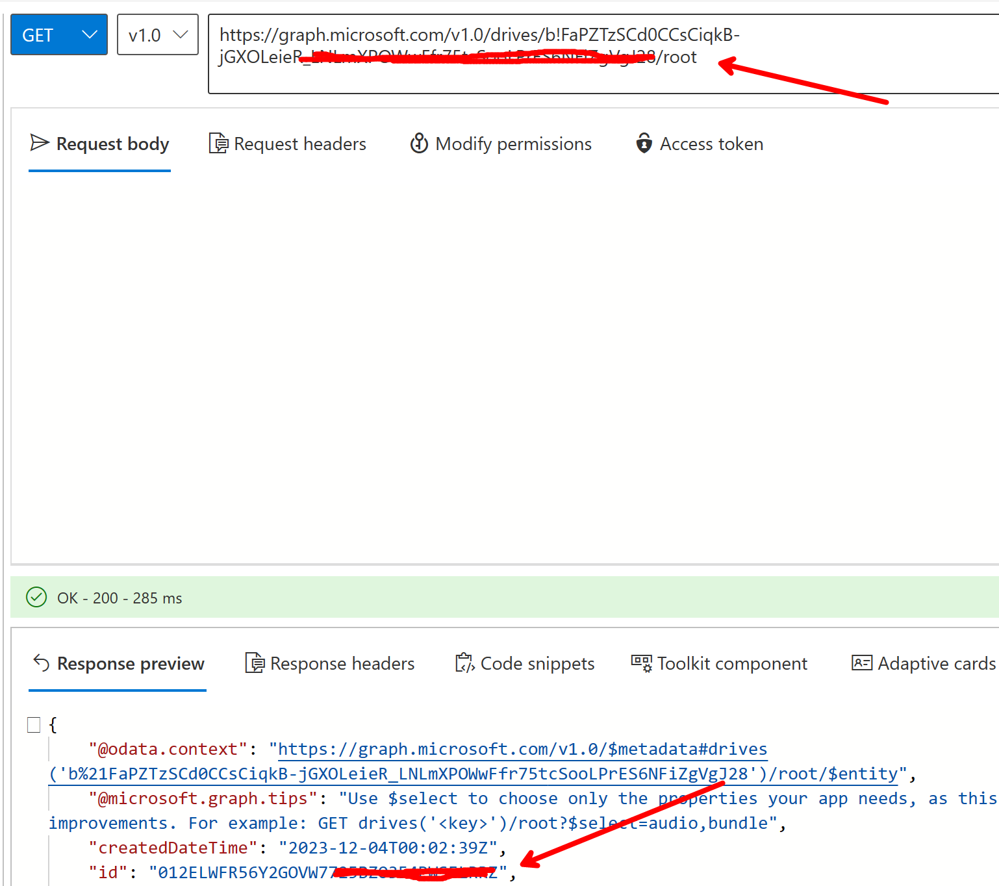

# Docx to PDF conversion: Azure Function

### Env Vars:

1. `CLIENT_APP_ID`: The client App ID of the User-Assigned Managed Idenity on the function resource

The necessary permissions are shown below - find the associated enterprise application for the managed identity and assign the following graph permissions.

2. `DRIVE_ID`: The Drive ID of the sharepoint site you wish to use for the conversion. 

3. `ITEM_ID`: The folder in the drive that will be used for the conversion.

You can find the two IDs above by running the queries as shown below:

a. First, obtain the site ID for the sharepoint site. Fill in your sharepoint url and site name as shown:

b. Next, run `/sites/{site-id}/drives` to see the Drive ID of the document library associated with the site. This is the value for `DRIVE_ID`:

c. Finally, run `/drives/{drive-id}/root` to get the ITEM_ID which will be used as another env var below:

